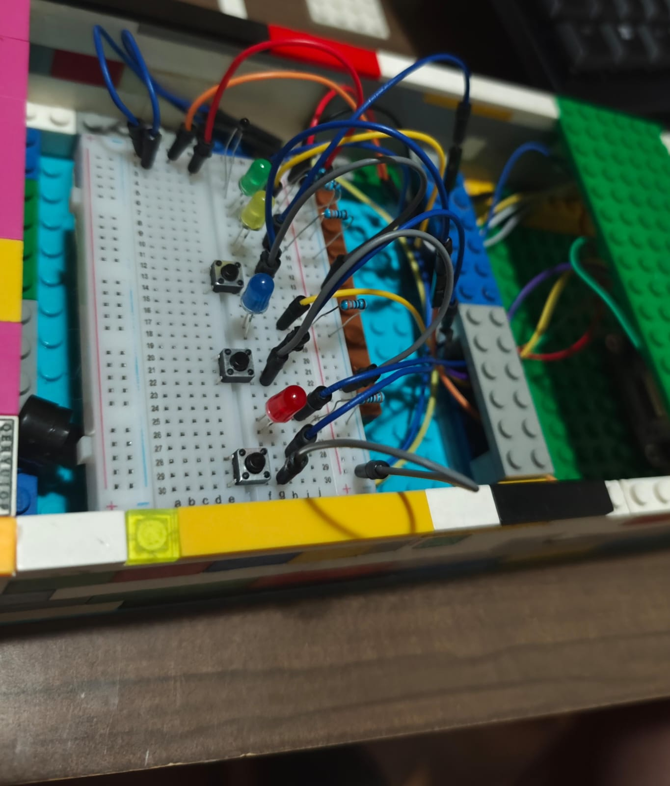

# rocketduo-expocenfo-25

# Configuración del entorno de desarrollo

1. **Instalar dependencias necesarias**  
   Se utiliza `python-dotenv` para manejar las claves. \
   Se usa `flask` como microframework para crear el backend del proyecto. \
   Se usa `flask-cors` para permitir Cross-Origin-Resource-Sharing entre el backend y frontend. \
   Se utiliza `requests` para realizar solicitudes HTTP, por ejemplo, a la API de Azure Cognitive Services para generar audio. \
   Se usa `openai` para enviar prompts y recibir respuestas de modelos como GPT-3.5 de OpenAI. \
   Se usa `twilio` para el envío de notificaciones a través de SMS en respuesta a eventos del ESP32. \
   Se usa `azure-storage-blob` para la generación de un URL publico para consultar los audios en Azure. \
   Se usa `azure-cosmos` para el almacenamiento del JSON en la base de datos en Azure. \
   Se usa `apscheduler` para generar alertas climáticas periódicamente. 
   
   Ejecutá el siguiente comando en tu entorno virtual o sistema:

   ```bash
   pip install python-dotenv flask flask-cors requests openai twilio azure-storage-blob azure-cosmos apscheduler

3. **Crear archivo de configuración de entorno (.env)** \
Este archivo se utiliza para definir claves privadas como tokens de API.
Por ejemplo:

   ```bash
   OPENAI_API_KEY=clave_de_openai_aqui
   TWILIO_AUTH_TOKEN=token_de_twilio

4. **Crear archivo config.py para cargar las variables**
Este archivo lee las claves del archivo .env y las expone como constantes reutilizables en todo el proyecto:

   ```bash
   from dotenv import load_dotenv
   import os

   load_dotenv()

   OPENAI_API_KEY = os.getenv("OPENAI_API_KEY")

  5. **Proteger información sensible** \
  El archivo .env ha sido agregado al archivo .gitignore para evitar que las claves se suban al repositorio público.

# Estructura del Proyecto

```plaintext
rocketduo-expocenfo-25/
├── backend/
│   └── config
│        └── config.py          # Carga de variables desde .env
│   └── routes
│        └── clothing_api.py    # Endpoints para consultar y ejecutar recordatorios de abrigo
│        └── esp32_api.py       # Endpoints para consultar y ejecutar eventos del esp32
│        └── scheduler_api.py   # Endpoints para consultar y ejecutar el scheduler
│        └── weather_api.py     # Endpoints para consultar la temperatura
│   └── service
│        └── clothing_service.py  # Recordatorios de abrigo en base a temperatura
│        └── cosmos_handler.py    # Conexión con Azure Cosmos DB
│        └── llm_handler.py       # Comunicación con OpenAI (LLM)
│        └── scheduler_service.py # Lógica central del Scheduler
│        └── twilio_handler.py    # Envío de SMS con Twilio
│   └── utils
│        └── audio_exporter.py    # Envío de audio generado localmente a Azure Blob Storage
│        └── date_calculator.py   # Cálculo de fechas del tratamiento
│        └── tts_generator.py     # Conversión de texto a audio con Azure  
│ 
│   └── main.py                   # Punto de entrada del programa
│   
├── esp32/MediAmigo_IdeaBoard
│        └── MediAmigo_IdeaBoard.ino  # Punto de entrada del ESP32
│        └── audio_player.h           # Enciende LEDs y reproduce audio en servidor
│        └── button_handler.h         # Envío de mensajes al presionar botones
│        └── buzzer_controller.h      # Reproducción de sonidos
│        └── config.h                 # Configuración de pines de ESP32
│        └── led_controller.h         # Condiguración de LEDs
│        └── reminder_manager.h       # Manejo de recordatorios
│        └── server_communication.h   # Comunicación con servidor
│        └── temperature_sensor.h     # Lógica del sensor de temperatura
│        └── time_manager.h           # Manejo y consulta del tiempo
│        └── wifi_manager.h           # Configuración del wifi
├── node_modules
│   └── config.js          # Módulos que permiten el funcionamiento del programa
│
├── static/               
│   └── index.html         # Interfaz web
│   └── index.css          # Estilos de interfaz web
│
├── .env                   # Variables de entorno (ignorado por Git)
├── LICENSE                # Licencia (CC BY-NC-SA 4.0) de MediAmigo
└── .gitignore             # Archivos que no se subirán al repositorio
```

# Descripción de los principales módulos del Backend
`main.py` \
Punto de entrada del programa.

`llm_handler.py` \
Comunica con OpenAI para transformar frases en JSON.

`twilio_handler.py` \
Envía mensajes SMS si se presionan botones en el ESP32.

`tts_generator.py` \
Convierte el mensaje del JSON en un archivo .wav con Azure Text-To-Speech.

`cosmos_handler.py` \
Conexión con Azure Cosmos DB para almacenamiento de JSON.

`date_calculator.py` \
Calcula la fecha de los recordatorios en base a la información extraída por el modelo.

`audio_exporter.py` \
Sube los audios generados localmente a un url en Azure Blob Storage.

`config.py` \
Carga las claves desde .env para que el resto de módulos las usen.

# Componentes funcionales del sistema

## Uso del modelo de lenguaje (LLM)
- Se utiliza `gpt-3.5-turbo` con un prompt diseñado para extraer:
  - quien
  - hora (`HH:MM`)
  - medicamento
  - mensaje para la persona adulta mayor
  - nombre del archivo `.wav` generado
  - frecuencia
  - dias que debe tomarse
  - duracion del tratamiento

- Ejemplo de entrada:
  > Mi abuela toma aspirina a las 6 p.m.

- Ejemplo de salida:
```json
{
  "quien": "abuela",
  "hora": "18:00",
  "medicamento": "aspirina",
  "mensaje": "Abuela, son las seis. Hora de tomar aspirina.",
  "audio_filename": "aspirina_1800.wav",
  "frecuencia": "una vez al día",
  "dias": ["todos"],
  "duracion_dias": 0
}
```


## Text-to-Speech con Azure para generación local del audio

- Se usa `es-CR-MariaNeural` como voz en español femenina.
- Formato de salida: `riff-16khz-16bit-mono-pcm`
- El archivo se guarda con el nombre especificado en el JSON.

## Generación de la url para accesar al audio en la nube con Azure Blob Storage

- Archivo es subido a Blob Storage y este servicio le asigna un url para poder descargar y accesar el audio.
- Permite accesar al audio desde cualquier parte del mundo a través de la URL

## Almacenamiento de datos en Azure Cosmos DB

- Información de los recordatorios es almacenada en la nube con Azure Cosmos DB.


## Interfaz de Usuario (HTML)

- Se muestran instrucciones de uso al usuario
- Entrada: campo de texto para frase en lenguaje natural.
- Envío: se realiza a través de `fetch('/frase')`.
- Respuesta:
  - Se muestra mensaje de espera
  - Luego mensaje `Audio configurado correctamente...`
- Diseño responsive, simple y accesible.


# Flujo general del sistema

Este sistema permite transformar una frase escrita por el usuario en un recordatorio automatizado con audio que será reproducido por un dispositivo ESP32. A continuación se describe el flujo completo:

1. **Entrada del usuario**  
   El usuario escribe una frase en lenguaje natural (por ejemplo, “Mi abuela toma aspirina a las 6 p.m.”) desde la interfaz web.


2. **Envío al backend**  
   Esta frase se envía mediante una solicitud `POST` al endpoint `/frase` del backend, desarrollado con Flask.


3. **Procesamiento con LLM (OpenAI)**  
   El backend utiliza el módulo `llm_handler.py` para enviar la frase al modelo `gpt-3.5-turbo`, que genera un objeto JSON estructurado con los siguientes datos:
   - quien 
   - hora
   - medicamento
   - mensaje personalizado
   - nombre del archivo de audio a generar
   - frecuencia ej. dos veces al día, cada 8 horas
   - dias en que debe tomarse
   - duracion del tratamiento


4. **Generación de audio con Azure TTS**  
   El texto del mensaje es enviado al servicio de Text-to-Speech de Azure mediante el módulo `tts_generator.py`, y se genera un archivo `.wav`.

5. **Envío de audio a Azure Blob Storage**  
   El audio generado localmente es enviado al Azure Blob Storage para la generación de un URL que va a ser consultado por el ESP32.

6. **Respuesta al usuario**  
   La interfaz muestra un resumen de la configuración exitosa, incluyendo el mensaje, hora, medicamento y nombre del audio generado.


7. **Disponibilidad para el ESP32**  
   La configuración generada queda disponible para ser consultada por el ESP32. El ESP32 descargará los recordatorios programados, se reproducirá el audio a la hora indicada y el ESP32 encenderá luces LED como parte del recordatorio.


8. **Botones de emergencia** 
   Si se presiona alguno de los botones físicos, el ESP32 enviará un evento al backend, y el sistema usará `twilio_handler.py` para enviar un mensaje SMS al cuidador correspondiente.


# Componentes ESP32

Este sistema de asistencia incluye un conjunto de componentes físicos conectados al microcontrolador ESP32. A continuación se detallan los principales elementos involucrados:

# Conexiones y componentes del Circuito

## ESP32 IdeaBoard (CRCibernetica)
  Microcontrolador principal con Wi-Fi y Bluetooth integrado. Es el “cerebro” del sistema: consulta recordatorios al backend, controla sensores y actuadores.

## LEDs externos (Rojo, Verde, Azul, Amarillo)
  Funcionan como indicadores visuales claros y fáciles de entender:

  - **Rojo:** Emergencia médica
  - **Azul:** Tristeza o soledad
  - **Amarillo:** Hambre
  - **Verde:** Estado normal/OK

  → Cada LED está conectado con un **resistor de 330 Ω** para limitar la corriente y proteger tanto al LED como al ESP32.

## Botones de color negro
  Capturan eventos directos del usuario:

  - **Al presionar uno de ellos, enciende el led rojo:** Indica emergencia médica y envía SMS al cuidador.
  - **Al presionar uno de ellos, enciende el led Azul:** Indica tristeza/soledad.
  - **Al presionar uno de ellos, enciende el led Amarillo:** Indica hambre.

  → Cada botón utiliza un **resistor de 10 kΩ** como **pull-down** para evitar lecturas falsas cuando no se presiona.

## Termistor NTC 10 kΩ
  Sensor de temperatura ambiente. Permite generar recordatorios adaptativos como “hidratarse” o “ponerse un abrigo” en función del clima.\
  → Conectado en un **divisor de voltaje con una resistencia fija de 10 kΩ** para convertir los cambios de temperatura en valores analógicos legibles por el ESP32.

## Buzzer piezoeléctrico
  Proporciona alertas auditivas simples o melodías cortas cuando se activa un recordatorio o botón.\

## Resistores

  - **330 Ω:** Limitadores de corriente para LEDs.
  - **10 kΩ:** Resistencias pull-down para botones y divisor de voltaje del termistor.

## Fuente de poder
  - **Power bank:** ESP32 se alimenta desde este tipo de batería

## Imagenes del circuito completo
**Imagen número 1 del circuito final**



**Imagen número 2 del circuito final**


**Imagen número 3 del circuito final**


#  Instalación y Configuración del Sistema

Esta sección detalla cómo preparar el entorno de desarrollo y ejecutar el sistema completo, incluyendo el backend, frontend y la interacción con el ESP32.

##  Requisitos Previos

- Python 3.8+
- pip
- Cuenta en OpenAI
- Cuenta en Azure para utilización de Audio Services, Azure Blob Storage y Cosmos DB
- Arduino IDE instalado
- Placa ESP32 DevKit
- Conexión a Internet

## Instalación del entorno Python

1. **Clonar el repositorio**

2. **Instalar dependencias necesarias**

```bash
pip install python-dotenv flask flask-cors requests openai twilio azure-storage-blob azure-cosmos apscheduler
```

3. **Crear archivo `.env` con las claves de API necesarias**

```bash
OPENAI_API_KEY=tu_clave_openai
AZURE_SPEECH_KEY=tu_clave_azure
AZURE_SPEECH_REGION=eastus2
```

4. **Agregar `.env` al archivo `.gitignore`**

```bash
.env
```

## Ejecutar el servidor Flask

```bash
python main.py
```

El servidor estará disponible por defecto en [http://localhost:5000](http://localhost:5000)

## Probar el frontend

1. Abrí `static/index.html` en tu navegador.

2. Ingresá una frase como:

```
Mi abuela toma aspirina a las 6 p.m.
```

3. Se generará el archivo `.wav` con el mensaje personalizado y se mostrará el resumen de configuración.

## Preparar el ESP32

1. Abrí el Arduino IDE.
2. Conectá el ESP32 a la PC.
2. Seleccioná la placa: **ESP32 Dev Module**
3. Cargá los archivos disponibles en la ruta esp32/MediAmigo_IdeaBoard como sketch al ESP32.

##

# Consideraciones Técnicas
- El ESP32 actúa como cliente y consulta periódicamente al backend.
- La generación de audio se realiza de forma sincrónica antes de responder al cliente.
- Se usa una arquitectura modular para separar claramente los componentes.

# Recomendaciones de Uso
- **Conexión Wi-Fi:** asegurarse de que el ESP32 esté en la misma red que el backend durante las pruebas.

- **Audios generados:** los archivos .wav generados deben estar accesibles para el ESP32 (ya sea descargados o pregrabados).

- **Mensajes SMS:** el número de teléfono del cuidador debe estar configurado en el backend (en twilio_handler.py).

##

# ✅ MediAmigo - Asistente de Medicación listo para utilizar.


