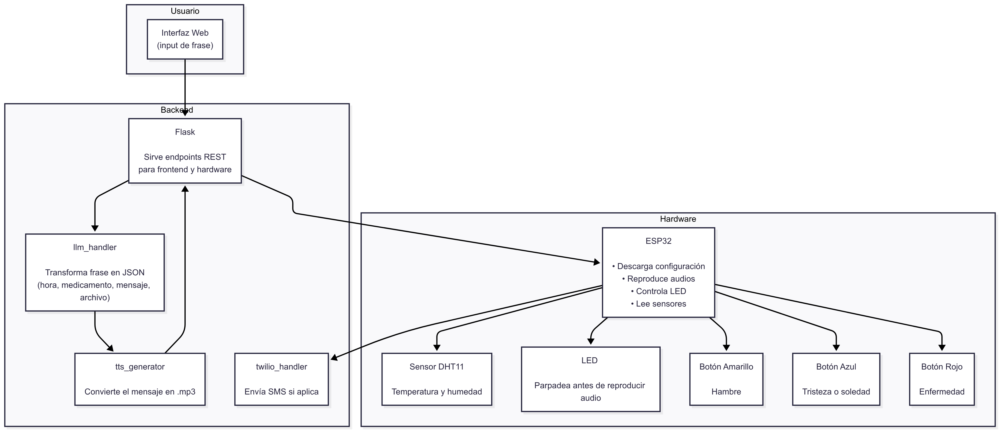
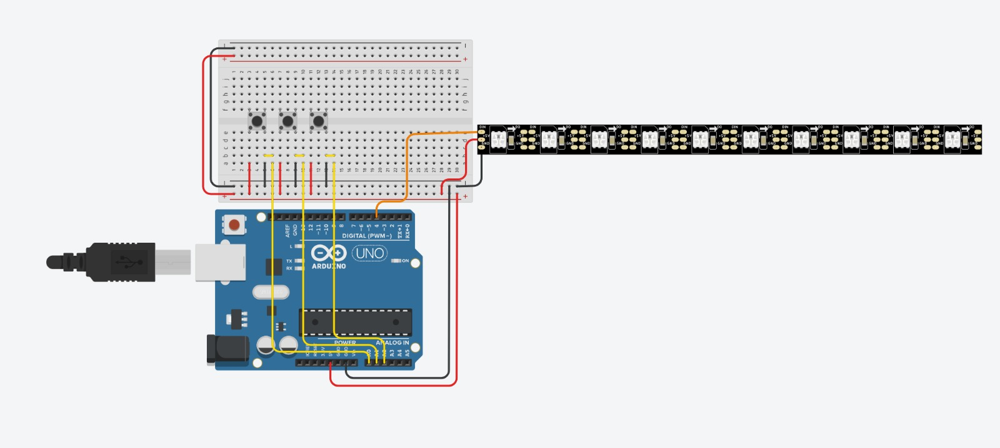

# Avance Preliminar del Proyecto

## 1. Información del Proyecto
- **Nombre del Proyecto:** MediAmigo - Asistente de Medicación.
- **Equipo:** 
    - Kendra Sancho Vega
    - Josias Hidalgo
    - Gabriel Porras

- **Roles:** 
  - Coordinadora y desarrolladora: Kendra Sancho Vega.
  - Arquitecto de Hardware y desarrollador: Josias Hidalgo.
  - Desarrollador: Gabriel Porras.


## 2. Descripción y Justificación
- **Problema que se aborda:** Las personas adultas mayores, especialmente aquellas que viven solas o tienen condiciones de salud crónicas, suelen olvidar tomar sus medicamentos a tiempo. Esto puede derivar en complicaciones médicas, hospitalizaciones innecesarias o disminución en la efectividad del tratamiento.

- **Importancia y contexto:** En el contexto de una población envejecida, los recordatorios accesibles, amigables y personalizados se vuelven esenciales. Las soluciones tecnológicas actuales suelen requerir conectividad constante, interfaces complejas o suscripciones, lo cual no es ideal para este grupo demográfico. Este proyecto ofrece una alternativa accesible que automatiza recordatorios por medio de voz y hardware sencillo (ESP32), asegurando adherencia al tratamiento.

- **Usuarios/beneficiarios:**
  - Personas adultas mayores con tratamientos médicos regulares.
  - Cuidadores familiares que desean monitorear la adherencia sin depender de su presencia constante.
  - Instituciones médicas o centros de cuidados con pacientes parcialmente autónomos.


## 3. Objetivos del Proyecto
- **Objetivo General:** Desarrollar un sistema de asistencia médica que genere y reproduzca recordatorios personalizados en voz para adultos mayores, usando entrada en lenguaje natural, procesamiento con inteligencia artificial y reproducción autónoma en un dispositivo físico (ESP32).

- **Objetivos Específicos:**  
  - Implementar una interfaz sencilla para ingresar frases en lenguaje natural.

  - Procesar dichas frases mediante un modelo LLM (GPT) para obtener información estructurada.

  - Generar un archivo de audio (.wav) con voz natural usando Azure Text-to-Speech.

  - Servir esta configuración en formato JSON para su lectura por el ESP32.

  - Reproducir el audio en el ESP32 en la hora indicada a través de altavoces.

  - Enviar alertas vía SMS mediante Twilio en caso de interacción del usuario.

## 4. Requisitos Iniciales
- Lista breve de lo que el sistema debe lograr:  

  - El sistema debe recibir frases como “Mi abuela toma enalapril a las 8 a.m.” y extraer automáticamente la hora, medicamento y mensaje.

  - El sistema debe generar un archivo de audio con voz clara y humanizada usando Azure.

  - El ESP32 debe obtener la programación vía una ruta /configuracion y reproducir el audio a la hora indicada.

## 5. Diseño Preliminar del Sistema
- **Arquitectura inicial (diagrama):**  
Diagrama de flujo la conexión entre backend y hardware
  


- **Componentes previstos:**  
  - Microcontrolador: ESP32
  - Sensores/actuadores: 
    - Sensor: Termómetro
    - Actuadores: Tres botones
  - LLM/API:  OpenAI
  - Librerías y herramientas: python-dotenv, flask, openai 

- **Bocetos o esquemas:**  
  Diagrama de flujo de la conexión entre componentes del hardware
  

  Nota: Como referencia se usó el Arduino para representar el microcontrolador, sin embargo, la conexión sería distinta al tratarse de un ESP32.

## 6. Plan de Trabajo
- **Cronograma preliminar:**  
*Período: 4 al 18 de agosto de 2025*

  | ID | Tarea | Fecha Estimada | Duración |
  |----|-------|----------------|----------|
  | 298 | Implementar efectos visuales según tipo de evento | 6 de agosto | 2-3 días |
  | 299 | Conectar botones (rojo, azul, amarillo) a pines digitales | 5 de agosto | 1-2 días |
  | 300 | Detectar cuál botón fue presionado | 7 de agosto | 1-2 días |
  | 301 | Enviar POST al backend cuando se presione un botón | 9 de agosto | 2 días |
  | 302 | Conectar sensor DHT22 a pin digital | 8 de agosto | 1 día |
  | 303 | Leer temperatura y humedad usando DHT | 10 de agosto | 1-2 días |
  | 304 | Condicionar respuesta según temperatura y humedad | 12 de agosto | 2 días |
  | 305 | Reproducir mensaje automático según condiciones ambientales | 15 de agosto | 2-3 días |


- **Riesgos identificados y mitigaciones:**  

| Riesgo | Descripción | Mitigación |
|--------|-------------|------------|
|  **Dependencia de conexión a internet** | El sistema requiere una conexión estable para obtener configuraciones, usar el modelo LLM y enviar SMS. | Usar una red Wi-Fi confiable. Documentar requerimientos de red.|
|  **Fallo en servicios externos (OpenAI, Azure, Twilio)** | El sistema depende de servicios de terceros para funciones clave como síntesis de voz, interpretación y envío de alertas. | Manejo de errores robusto y mensajes claros al usuario. Considerar reintentos automáticos. |
|  **Interrupciones de energía o reinicios del ESP32** | La pérdida de energía podría reiniciar el dispositivo, afectando su funcionamiento. | Habilitar reconexión automática al encender. Descargar configuración al reiniciar. Considerar batería de respaldo. |
|  **Interpretación errónea de frases** | El modelo LLM podría interpretar mal frases ambiguas o poco claras. | Restringir frases aceptadas. Validar la salida antes de generar audio. Mostrar mensaje al usuario para confirmación. |
|  **Falla en reproducción de audio** | El audio podría no sonar por fallos del altavoz o mal conexión del módulo de audio. | Pruebas físicas previas. Usar LEDs como apoyo visual en cada recordatorio. |
|  **Interfaz poco amigable para adultos mayores** | Las personas adultas mayores podrían no comprender o interactuar fácilmente con el sistema. | Minimizar interacción directa. Controlar desde cuidador. Usar sonidos e indicadores simples y visibles. |
|  **Mal uso del sistema (uso no previsto)** | El sistema podría ser utilizado fuera del contexto original (por ejemplo, para enviar frases ofensivas o bromas). | Validar frases y limitar los mensajes generados. Posible moderación del contenido previo a la síntesis o envío. |


## 7. Prototipos conceptuales (si aplica)
- **Código mínimo de prueba:**  
 ```python
def frase_a_json(frase):
    try:
        response = client.chat.completions.create(
            model="gpt-3.5-turbo",
            temperature=0.2,  # determina qué tan creativo o arriesgado es el modelo
            messages=[
                {"role": "system", "content": PROMPT_INICIAL},
                {"role": "user", "content": frase},
            ]
        )
        contenido = response.choices[0].message.content.strip()
        return contenido
    except Exception as ex:
        return {"error": str(ex)}
```

- **Evidencia visual:**  
  